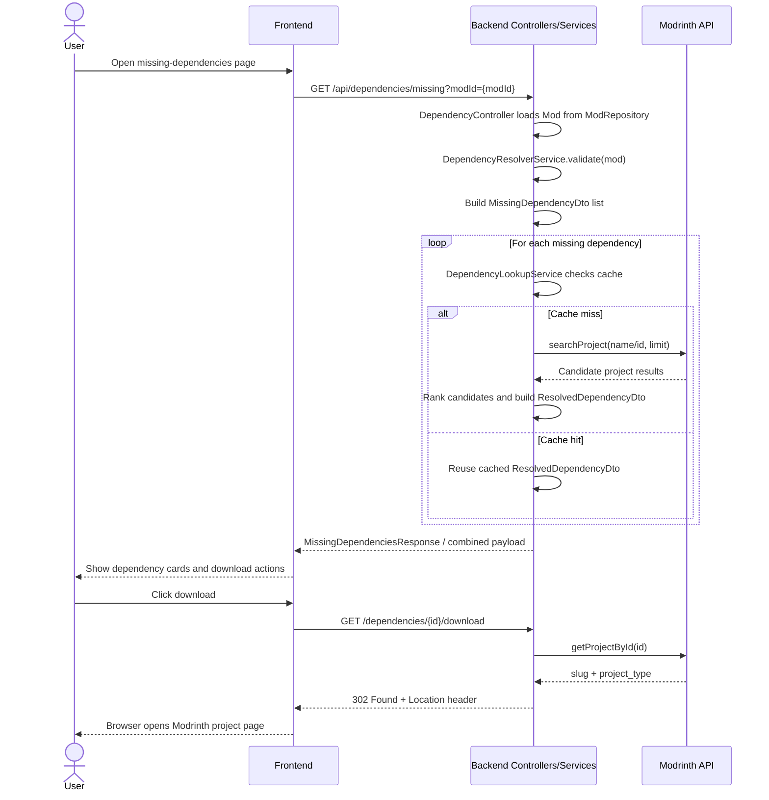

# Dependency Resolution and Download Flow

This document explains the integrated dependency-resolution pipeline across Subteam A and Subteam B. It covers how missing dependency data is produced, how Modrinth is queried, how results are transformed into DTOs, and how users are redirected to download pages.

## End-to-End Flow

Target integration flow:

`Request -> Backend -> Modrinth API -> DTO -> Controller -> Redirect -> User`

In this repository, that flow is split across two backend paths:

1. `GET /api/dependencies/missing`
   Produces the missing-dependency analysis result and resolved dependency candidates.
2. `GET /dependencies/{id}/download`
   Resolves a dependency id into a preferred Modrinth URL and returns an HTTP redirect.

### Pipeline Walkthrough

1. The user reaches the missing-dependencies UI at `/missing-dependencies`.
2. The frontend requests dependency analysis data from the backend.
3. The backend identifies missing dependencies for a selected mod.
4. The backend asks Modrinth for matching projects.
5. The backend converts Modrinth responses into DTOs for the frontend and redirect layer.
6. The frontend displays each missing dependency and offers a download action for resolved items.
7. When the user selects download, the backend redirect endpoint maps the dependency id to a preferred external link and issues a `302 Found`.
8. The browser follows the redirect to the Modrinth project page.

## Subteam Responsibilities

### Subteam A: Produce dependency data

Subteam A owns the missing-dependency analysis side.

Primary classes:

- `DependencyResolverService`
- `ModRepository`
- `DependencyController`
- `ValidationResponse`

Subteam A flow:

1. `DependencyController` receives the request for dependency analysis.
2. It loads the requested `Mod` from `ModRepository`.
3. It calls `DependencyResolverService.validate(mod)`.
4. `DependencyResolverService` walks the mod's `depends` list, checks whether required dependencies exist in `ModRepository`, and collects missing ids.
5. The missing ids are converted into `MissingDependencyDto` records so downstream lookup logic can resolve them.

This is the handoff point to Subteam B.

### Subteam B: Consume missing dependency data and resolve download targets

Subteam B owns lookup, external API interaction, DTO enrichment, and user-facing download behavior.

Primary classes:

- `DependencyLookupService`
- `ModrinthServiceWrapper`
- `DownloadRedirectController`
- `MissingDependencyDto`
- `ResolvedDependencyDto`
- `MissingDependenciesResponse` (intended response contract)

Subteam B flow:

1. `DependencyLookupService.resolveDependencies(...)` accepts the `MissingDependencyDto` list from Subteam A.
2. For each dependency, it validates the input and builds a cache key.
3. It checks `DependencyLookupCache` before making external requests.
4. On cache miss, it calls `ModrinthServiceWrapper.searchProject(...)` or `getProjectById(...)`.
5. It ranks candidate Modrinth results and creates a `ResolvedDependencyDto`.
6. The controller returns the resolved data to the frontend.
7. `DownloadRedirectController` later resolves a dependency id into a preferred URL and redirects the user.

## Backend Components

### `DependencyController`

File: `src/main/java/com/inso/MinecraftProject/service/DependencyController.java`

Role:

- Entry point for dependency analysis at `GET /api/dependencies/missing`
- Validates `modId`
- Loads the source mod from `ModRepository`
- Calls `DependencyResolverService`
- Converts missing ids into `MissingDependencyDto`
- Calls `DependencyLookupService.resolveDependencies(...)`
- Returns the combined analysis result

Current implementation note:

- The controller currently returns the older `DTO` object, where `missingDependencies` is a list of `Mod` objects and `resolvedDependencies` is a list of preferred-link strings.
- The newer frontend/test contract in this repository expects `MissingDependenciesResponse`, where `missingDependencies` contains `MissingDependencyDto` and `resolvedDependencies` contains `ResolvedDependencyDto`.

That means the documentation below reflects the intended integrated contract, while this repository still contains an implementation mismatch that should be resolved in code.

### `ModrinthServiceWrapper`

File: `src/main/java/com/inso/MinecraftProject/service/ModrinthServiceWrapper.java`

Role:

- Isolates all HTTP traffic to Modrinth
- Uses Java `HttpClient`
- Adds a project-specific `User-Agent`
- Parses JSON into `JsonNode`
- Normalizes API failures into `ApiException`

Main methods:

- `searchProject(String name, int limit)`
- `getProjectById(String slug)`
- `getProjectVersions(String slug)`
- `getVersionById(String versionId)`
- `getProjectDependencies(String slug)`

`DependencyLookupService` depends on this wrapper so Modrinth access is centralized and reusable.

### DTO Structure

#### `MissingDependencyDto`

File: `src/main/java/com/inso/MinecraftProject/dto/MissingDependencyDto.java`

Fields:

- `id`: dependency identifier
- `name`: display name if known
- `requiredVersion`: requested or discovered version requirement
- `loader`: loader context such as Fabric/Forge
- `mcVersion`: Minecraft version context

Purpose:

- Carries Subteam A's output into Subteam B's resolver
- Preserves enough metadata to improve candidate matching and frontend display

#### `ResolvedDependencyDto`

File: `src/main/java/com/inso/MinecraftProject/dto/ResolvedDependencyDto.java`

Fields:

- `id`: dependency identifier
- `name`: resolved display name
- `links`: candidate download/project URLs
- `preferred`: best URL to expose to the user

Purpose:

- Represents the result of external dependency lookup
- Gives the frontend a stable object for status display and download actions
- Gives the redirect controller a preferred destination

#### `MissingDependenciesResponse`

File: `src/main/java/com/inso/MinecraftProject/dto/MissingDependenciesResponse.java`

Fields:

- `missingDependencies`
- `resolvedDependencies`
- `analysisHasPartialResults`

Purpose:

- Intended combined response model for the results page
- Makes the partial-success state explicit
- Allows frontend mapping by dependency id

## Data Flow Between Components

### Analysis and lookup flow

1. `DependencyController` receives `modId`.
2. `ModRepository.findById(modId)` returns the selected mod.
3. `DependencyResolverService.validate(mod)` returns `ValidationResponse`.
4. Missing ids are transformed into `MissingDependencyDto`.
5. `DependencyLookupService.resolveDependencies(...)` resolves those DTOs.
6. `DependencyLookupService` checks `DependencyLookupCache`.
7. On cache miss, `ModrinthServiceWrapper` performs Modrinth API calls.
8. The resolver ranks candidates and builds `ResolvedDependencyDto`.
9. The controller returns a combined payload to the frontend.

### Redirect flow

1. The frontend or browser requests `/dependencies/{id}/download`.
2. `DownloadRedirectController` validates the path id.
3. It calls `DependencyLookupService.resolveDependencyById(id)`.
4. `DependencyLookupService` calls `ModrinthServiceWrapper.getProjectById(id)`.
5. The Modrinth project response supplies `slug`, `title`, and `project_type`.
6. `DependencyLookupService` builds a `ResolvedDependencyDto` whose `preferred` URL points to the correct Modrinth project page.
7. `DownloadRedirectController` returns `302 Found` with a `Location` header set to `preferred`.
8. The browser follows the redirect and the user lands on the external download page.

## Redirect Endpoint

### `GET /dependencies/{id}/download`

File: `src/main/java/com/inso/MinecraftProject/controller/DownloadRedirectController.java`

Behavior:

- Accepts a dependency id as a path variable
- Rejects blank ids with `400 Bad Request`
- Resolves the id through `DependencyLookupService.resolveDependencyById(...)`
- Returns `404 Not Found` if no preferred link can be resolved
- Returns `302 Found` with `Location: <preferred-url>` when resolution succeeds
- Returns `500 Internal Server Error` for unexpected failures

### How dependency ids map to download links

The mapping is runtime-derived from Modrinth metadata:

1. The backend calls `getProjectById(projectId)`.
2. The Modrinth response provides:
   - `slug`
   - `title`
   - `project_type`
3. `DependencyLookupService` chooses a base path from `project_type`:
   - `mod -> https://modrinth.com/mod/`
   - `modpack -> https://modrinth.com/modpack/`
   - `resourcepack -> https://modrinth.com/resourcepack/`
   - `shader -> https://modrinth.com/shader/`
   - fallback -> `https://modrinth.com/project/`
4. The backend concatenates `baseUrl + slug`.
5. That final URL becomes `ResolvedDependencyDto.preferred`.

Example:

- Dependency id: `AANobbMI`
- Modrinth returns slug: `fabric-api`
- Redirect target becomes: `https://modrinth.com/mod/fabric-api`

## Sequence Diagram

## Error Handling

### API failure

`ModrinthServiceWrapper` converts remote failures into `ApiException`.

Handled cases include:

- `401 Unauthorized`
- `404 Not Found`
- `429 Too Many Requests`
- `500 Internal Server Error`
- `503 Service Unavailable`
- malformed JSON or network failures

`GlobalExceptionHandler` converts `ApiException` into an HTTP response body with an `error` message.

### Dependency not found

Possible locations:

- `DependencyController`: requested `modId` is not in `ModRepository`
- `DependencyLookupService.resolveDependency(...)`: Modrinth search produces no valid candidate
- `DependencyLookupService.resolveDependencyById(...)`: Modrinth has no project for the requested id
- `DownloadRedirectController`: resolved dependency is empty or has no preferred link

Observed responses:

- `404 Not Found` for unknown mods or dependencies

### Invalid inputs

Handled validations include:

- blank `modId`
- blank dependency id
- null dependency request
- blank or invalid `requiredVersion`

Observed responses:

- `400 Bad Request`

### Unexpected internal failures

If an unexpected exception escapes the lookup/redirect path:

- `DependencyController` returns `500`
- `DownloadRedirectController` returns `500`
- `GlobalExceptionHandler` returns a generic `500` response for uncaught exceptions

## User-Facing Download Functionality

From the user's perspective, the integrated feature works like this:

1. The results page shows a card for each missing dependency.
2. Resolved dependencies are marked as available.
3. The UI exposes a download/view action.
4. That action should call `/dependencies/{id}/download`.
5. The backend resolves the dependency id and redirects the browser to Modrinth.

Current repository note:

- `missing-dependencies.js` currently links to the generic allowlisted redirect endpoint `/r?u=...`.
- `DownloadRedirectController` already implements the dependency-id based endpoint required by the integrated design.

The dependency-id redirect endpoint is the cleaner integration because the frontend only needs the dependency id; the backend remains responsible for mapping ids to external URLs.

## Recommended Canonical Flow

For the post-integration system, the clean contract should be:

1. Subteam A returns `MissingDependencyDto` items.
2. Subteam B enriches them into `ResolvedDependencyDto` items.
3. `DependencyController` returns `MissingDependenciesResponse`.
4. The frontend renders cards by matching `missingDependencies[i].id` against `resolvedDependencies`.
5. Download actions use `/dependencies/{id}/download`.

This preserves a clear separation:

- Subteam A decides what is missing.
- Subteam B decides where it can be downloaded.
- The frontend only presents status and actions.

