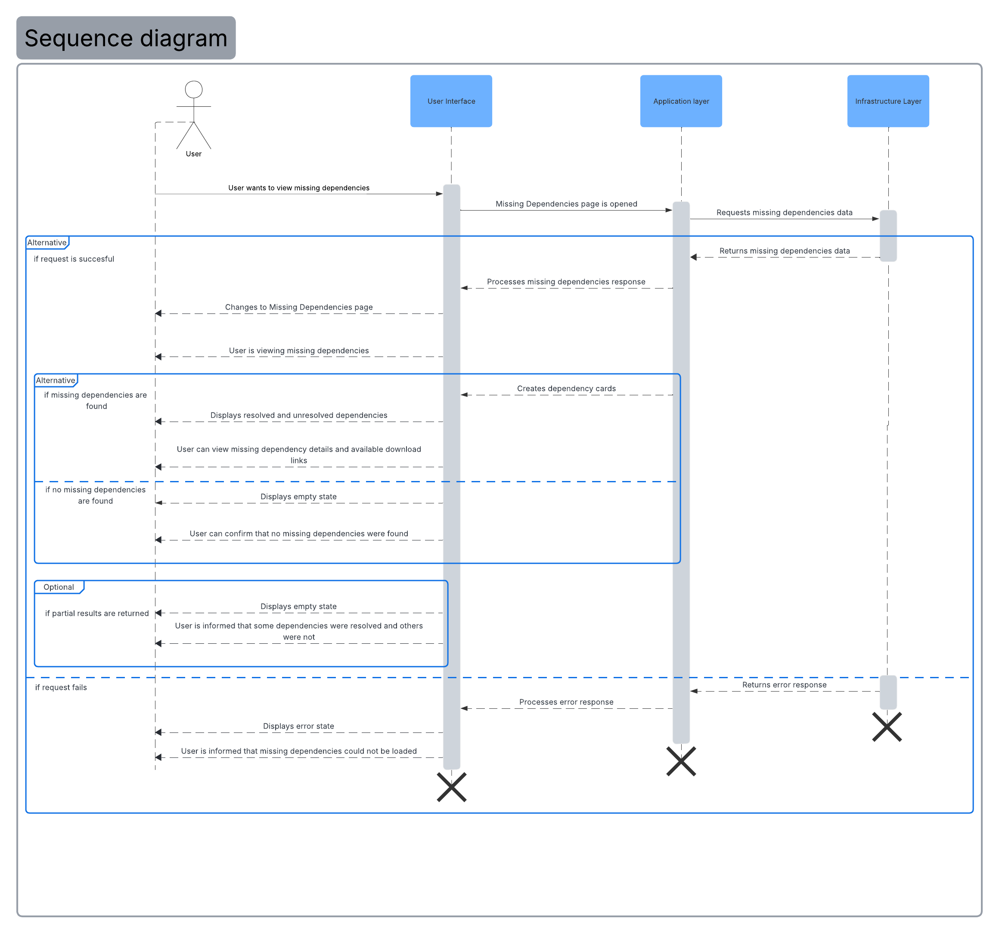

= Sequence Diagram — Missing Dependencies

== Overview

This document presents the sequence diagram associated with retrieving and displaying missing mod dependencies. It outlines the interactions that occur when a user accesses the Missing Dependencies page.

== Purpose

The purpose of this diagram is to illustrate how the system handles the retrieval of missing dependencies using a layered architecture. It shows how responsibilities are separated across the User Interface, Application Layer, and Infrastructure Layer, and how these layers interact to process requests and update the UI.

== Sequence Diagram

The sequence begins when the user opens the Missing Dependencies page. The User Interface triggers the Application Layer, which coordinates the request and communicates with the Infrastructure Layer through the backend API. The Infrastructure Layer processes the request and returns the corresponding data. The Application Layer then evaluates the response and determines how the User Interface should be updated.

Depending on the result, the system may display resolved and unresolved dependencies, show an empty state if no dependencies are found, present a partial results banner, or display an error message if the request fails. This sequence reflects how the system manages data flow across layers while providing feedback to the user.

